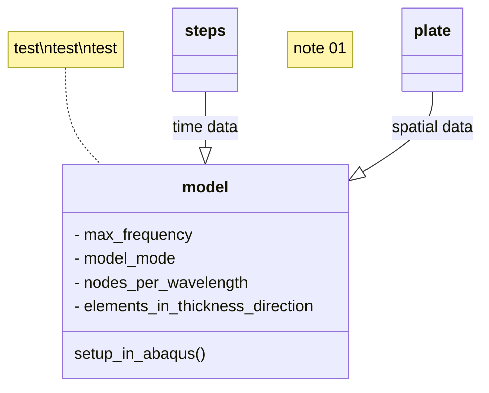

# GUW
A python module to simulate Guided Ultrasonic Wave (GUW) propagation and defect interaction in simple plates using Abaqus/Explicit. 

## Usage
- Clone repository

```mermaid
classDiagram
    note "note 01"
    note for model "test\ntest\ntest"
    steps --|> model : time data
    plate --|> model : spatial data
    class model{
        - max_frequency
        - model_mode
        - nodes_per_wavelength
        - elements_in_thickness_direction
        setup_in_abaqus()
    }
    class steps{
    }
    class plate{
    }
```
