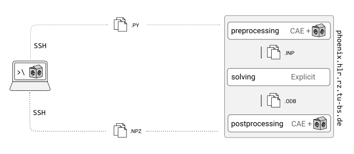

Batch processing (cluster)
==========================

For models that are computationally intensive, it is suitable to outsource the model generation and solving to the `Phoenix cluster <https://doku.rz.tu-bs.de/doku.php?id=hlr:phoenix>`_. Similar to the local workflow, this process can also be automated. The basic idea is to only transfer the (very small in size) model scripts from the local PC to the HPC cluster, and only download the extracted result files back to the local PC to minimize data traffic and workload on the local machine. 



A simple batch processing script on the local computer is used to initiate and control the pipeline on the cluster.

Using the batch processing script (cluster)
-------------------------------------------

General remarks
~~~~~~~~~~~~~~~~

The script ``...GUW\python\batch_remote.py`` provides a customizable template for batch processing of model files on the Phoenix cluster. It is similar to the local batch processing script, but more parameters need to be set and there are also a few other things to consider.

- The main difference when working on the Phoenix cluster is that ressources like CPU cores, RAM and computing time have to be allocated for each job. The Phoenix cluster uses `SLURM <https://slurm.schedmd.com/>`_ workload manager, which lets users allocate resources by submitting *job scripts* which specify the commands to run and the required resources. These resource parameters have to be set for all stages of the FE analysis, like preprocessing, solving and extracting results. The :ref:`batch wrapper functions <Batch wrapper functions (cluster)>` provided by GUWlib automatically create and dispatch the necessary job files during the batch process. 

- Subsequent stages of the provided script (preprocessing & solving, postprocessing, download of results) have to be run independently as the local script has no information about whether a previous stage is completed on the Phoenix cluster.

- The content of the ``...\GUW\python\`` directory has to be copied to the Phoenix cluster, as described in the :ref:`setup <Setup for use on TU BS Phoenix Cluster>` section. Specify the path to this directory in the ``remote_guwlib_path`` variable at the top of the ``batch_remote.py`` script.
   
Example usage
~~~~~~~~~~~~~~

In the following example, the ``...GUW\python\batch_remote.py`` script is set up to upload, preprocess and solve the model files ``models\examples\example_01.py``,  ``models\examples\example_02.py`` and ``models\examples\tutorial.py`` on the Phoenix cluster.

- For preprocessing (.PY files >> ABAQUS/CAE >> .INP files), 1 computing node with 10 cores is allocated on the *standard* partition and the estimated time to process **all** files is set to 1 h. If the process exceeds this time, the job is cancelled due to time-out.

- For solving (.INP files >> ABAQUS/Explicit >> .ODB files), 1 computing node with all of its 20 cores and a maximum time of 12 h is allocated on the *standard* partitionb **for each** of the previously generated .INP files. The jobs in this stage are executed strictly in series (one after the other) as to avoid blocking to many ABAQUS licenses.

.. literalinclude:: ../../../python/batch_remote.py
   :language: python
   :lines: 9-44
   
- For the stage of postprocessing (.ODB files >> ABAQUS/CAE >> .NPZ files), 10 min of computing time on the *standard* partition with 10 CPUs is allocated **for each** of the .ODB files. A maximum of 5 parallel executions of ABAQUS/CAE is specified (ABAQUS/CAE only blocks 1 token per instance).

- The ``results/`` directory (relative to the GUWlib path) is specified as the location to scan recursively for unprocessed results. The executed script will simply try to process all directories that contain an .ODB file, but no .NPZ file. One could, however, also explicitly specify the directories to search (e.g. ```results/tutorial/lc_0_burst_load_case/``). Forward backslashes are used on Linux to specify file paths!

- After the results extraction is done, :func:`~guwlib.functions_batch.remote.download_results` can be run to automatically download the .NPZ files that were written during the last call of :func:`~guwlib.functions_batch.remote.extract_results`.

.. literalinclude:: ../../../python/batch_remote.py
   :language: python
   :lines: 46-67

----------------------------------------------------------------------------------------------------------------------
  
Tricks for working with ABAQUS on the Phoenix Cluster
-----------------------------------------------------

Some commands or tools are particularly useful when monitoring and managing ABAQUS jobs and are described shortly in this section. For a more beginner/complete guide on how to work on Linux using the CLI, look up e.g. the `Phoenix documentation <https://doku.rz.tu-bs.de/doku.php?id=hlr:phoenix:basics_command_line_shell_scripts>`_.

Submit, monitor and cancel jobs
~~~~~~~~~~~~~~~~~~~~~~~~~~~~~~~~~

- A job file can be submitted via `sbatch <https://slurm.schedmd.com/sbatch.html>`_: ::
	
	$ sbatch jobile.job
	
- To show your jobs that are currently in the queue, use `squeue <https://slurm.schedmd.com/squeue.html>`_: ::

	$ squeue -u <username>
	
  When you have ABAQUS jobs running, that were created with the guwlib batch processing scripts, the ouput might look something like this:
  
  .. code-block:: text
  
    [username@login01 ~]$ squeue -u <username>
               JOBID PARTITION     NAME     USER ST       TIME  NODES NODELIST(REASON)
             2676018  standard example_ username PD        0:0      1 (Dependency)
             2676017  standard example_ username R     0:12:21      1 node001
		   
  In this case, two jobs are queued up, the first job (2676017) is running for 12 minutes and the second one is pending, waiting for the first job to be completed.
  
- To see the live output of a job, you can `tail <https://wiki.ubuntuusers.de/tail/>`_ the logfile that is associated with this job. To see the file path of the log-file for a given job id, run `scontrol <https://slurm.schedmd.com/scontrol.html>`_: ::

	$ scontrol show <JOBID>

  and then, with the file location of the log file, run: ::
  
	$ tail -f <log_file_path>
	
  to continously monitor the output that is written to the log file.
  
- Another helpful tool to analyze the workload caused by a job is `top <https://wiki.ubuntuusers.de/top/>`_, which shows a dynamic overview of running processes and system resources. For a specific job, check which node it runs on, connect to that node via SSH, and run top, e.g.: ::

	$ ssh node001
	$ top
	
- To cancel a job, run `scancel <https://slurm.schedmd.com/scancel.html>`_: ::

	$ scancel <JOBID>
	
- To see an overview of completed jobs (including failed jobs), use `sacct <https://slurm.schedmd.com/sacct.html>`_: ::

	$ sacct -u <username>
	

Current ABAQUS licenses in use
~~~~~~~~~~~~~~~~~~~~~~~~~~~~~~~

- To see how many ABAQUS licenses are currently in use, run ::

	$ abaqus licensing lmstat -a
	
  on any computer within the TU BS network with ABAQUS installed.

File transfer
~~~~~~~~~~~~~~

- `FileZilla <https://filezilla-project.org/index.php>`_ is a good GUI tool for SSH file transfer.
	

-------------------------------------------------------------------------------

Illustration of the cluster batch processing pipeline
------------------------------------------------------

It can be helpful to understand how the different scripts and functions interact with each other when working with the batch scripts or when debugging or extending them.

Building and solving 
~~~~~~~~~~~~~~~~~~~~~

The batch process of building and solving is visualized below.

.. raw:: html

   <div style="text-align: center;">
       
   </div>

- The :func:`~guwlib.functions_batch.remote.build_and_solve()` function uploads the specified model files (.PY) as well as an initial .JOB (``preproc.job``) file to the cluster via SSH.
- The ``preproc.job`` file is submitted on the cluster and calls the ``cluster_pre.py`` script with respective command line arguments, specifying which .PY files to preprocess.
- The ``cluster_pre.py`` script iterates over the list of .PY files, submitting them to ABAQUS/CAE as subprocesses. For each model script (.PY), one or more .INP files are created, depending on the number of load cases specified.
- For each .INP file created, the ``cluster_pre.py`` script also writes a .JOB file. The job files are generated to call the ABAQUS solver on the respective .ODB files, and they're generated in a way such that the :math:`(i+1)` th job is only started after the :math:`i` th job is finished.
- Each ABAQUS solver job will read the respective .INP file and write out an .ODB file.

Typically, the jobs calling the ABAQUS solver are resource-intensive and will run much longer than the preprocessing job. Enough resources (CPUs, computing time) have to be allocated for these jobs.

Extracting results
~~~~~~~~~~~~~~~~~~~

The process of extracting results is also visualized below.

.. raw:: html

   <div style="text-align: center;">
       
   </div>
   
- The :func:`~guwlib.functions_batch.remote.extract_results()` function uploads a job script (``postproc.job``) to the the cluster via SSH, calling the ``cluster_post.py`` script on the cluster and specifying a list of directories to check for unprocessed results.
- The ``cluster_post.py`` script scans the provided directories and their subdirectories for folders that contain .ODB, but no .NPZ files, and for each file found, it writes out a .JOB file.
- The job files are generated to call ABAQUS/CAE along with a history / field export helper script to open the .ODB file and export the relevant data to an .NPZ file. Job files are generated in a way such that a specified maximum of CAE instances can run simultaneously (in this example, a maximum of 2 CAE processes will run at the same time).
- As a result, for each .ODB file, an .NPZ file is generated, containing the extracted field or history data in a compact NumPy binary format. Also, a .TXT file with a list of the file paths to all .NPZ files extracted in the previous step is written out, allowing for a convenient batch download. 

--------------------------------------------------------------------------------

Batch wrapper functions (cluster)
---------------------------------

.. autofunction:: guwlib.functions_batch.remote.build_and_solve

.. autofunction:: guwlib.functions_batch.remote.extract_results

.. autofunction:: guwlib.functions_batch.remote.download_results


