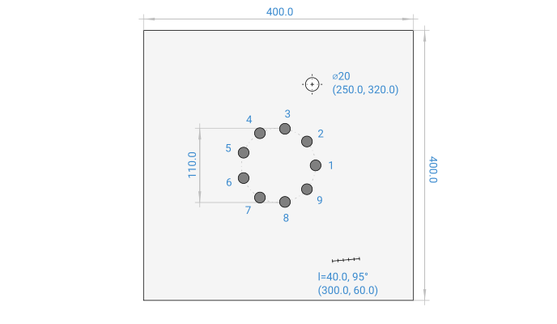
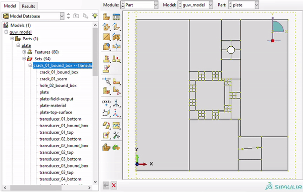

Writing a model script
======================

To illustrate the process of defining and executing a model script in ABAQUS/CAE using GUWlib, an example is presented. 

Objective and data
-------------------

The aim is to create a script that generates a :math:`400 \cdot 400 \cdot 3\;\mathrm{mm}` aluminum plate FE model with a :math:`\varnothing 20\;\mathrm{mm}` through hole in the upper right quarter of the plate and a :math:`40\;\mathrm{mm}` crack in the lower right quarter of the plate. A circular phased array with 9 transducers and a phased array radius of :math:`55\;\mathrm{mm}` is applied to the plates surfaces, as illustrated below.

The material data for 1100 aluminum alloy is as follows: the density (:math:`\rho`) is :math:`2710.0\;\mathrm{kg/m^3}`, the Young's modulus (:math:`E`) is :math:`69.0\;\mathrm{GPa}`, and the Poisson's ratio (:math:`\nu`) is :math:`0.33`. 

The plate is excited by a 3-cycle Hanning-windowed burst (center frequency :math:`50\;\mathrm{kHz}`) on transducer 1, while only antisymmetric modes should be excited. No excitation signal should be applied to any other than the exciting transducer; the remaining transducers are only used for measurement.

..
    +-----------------------------+---------------------------------+
    | Parameter                   | Value                           |
    +=============================+=================================+
    | :math:`\rho` (density)      | :math:`2710.0\;\mathrm{kg/m^3}` |
    +-----------------------------+---------------------------------+
    | :math:`E` (youngs modulus)  | :math:`69.0\;\mathrm{GPa}`      |
    +-----------------------------+---------------------------------+
    | :math:`\nu` (poissons ratio)| :math:`0.33`                    |
    +-----------------------------+---------------------------------+

Creating the model with Python
-------------------------------

Skeleton file
~~~~~~~~~~~~~~~

At first, we create a new python script. In this example, we will name it ``tutorial.py`` and save it to the ``...\GUW\python\models\examples\`` path. We start with the general skeleton for a GUWlib model, in which we import ``guwlib`` and define a new class that inherits from the base class :class:`~guwlib.FEModel`. For this example, we simply name our class ``Model`` (but any name is possible). The parameters of our model will be defined by overriding the :meth:`~guwlib.FEModel.setup_parameters` method of the base class and setting the respective instance variables for simulation parameters, plate, defects, transducers and load cases.

We also add one line of top-level code that will be executed when we run the script in ABAQUS. This line instantiates the newly defined class, and it also calls the :meth:`~guwlib.FEModel.setup_in_abaqus` method. Calling this method ensure that the code which will generate the FE model in ABAQUS is executed .  

.. code-block:: python

    from guwlib import *
    
    class Model(FEModel):
        def setup_parameters(self):
        
        # self.max_frequency = ...
        # self.elements_per_wavelength = ...
        # self.elements_in_thickness_direction = ...
        # self.model_approach = ...
        # 
        # self.plate = ...
        # self.defects = ...
        # self.transducers = ...
        # self.loadcases = ...
    
    if __name__ == "__main__":
        Model().setup_in_abaqus()

Simulation parameters
~~~~~~~~~~~~~~~~~~~~~~

We want our model to be discretized with 16 elements per wavelength and 8 elements in the plates' thickness direction in a frequency range of approximately :math:`0` to :math:`100\;\mathrm{kHz}`, and the transducers should be represented by concentrated forces. This can be done by setting the repsective instance variables, so we add the following lines (note that we define all physical values in SI units (frequency: :math:`\mathrm{Hz}`)):

.. code-block:: python
    :emphasize-lines: 6,7,8,9

    from guwlib import *
    
    class Model(FEModel):
        def setup_parameters(self):
            # basic simulation parameters ---------------------------------------------------------
            self.max_frequency = 100e3
            self.elements_per_wavelength = 16
            self.elements_in_thickness_direction = 8
            self.model_approach = 'point_force'
    
    if __name__ == "__main__":
        Model().setup_in_abaqus()

Geometry and material
~~~~~~~~~~~~~~~~~~~~~~

Next, we define the aluminum plate, the defects and the transducer array by setting the respective instance variables. Again, lengths are defined in SI units (:math:`\mathrm{m}`).

- For aluminum plate, we create an instance of the :class:`~guwlib.guw_objects.IsotropicMaterial` class, where we can just pass the material name as a string, as aluminum alloy 1100 is a pre-defined material (also see :ref:`Adding materials to the material library`). The plate is created by instantiating the :class:`~guwlib.guw_objects.plate.IsotropicRectangularPlate` class with the plate's material, width, length, and thickness.
 
- Defects have to be defined as a list of :class:`~guwlib.guw_objects.defects.Defect` objects. We simply add the :class:`~guwlib.guw_objects.defects.Hole` and the :class:`~guwlib.guw_objects.defects.Crack` by instantiating objects with respective arguments specifying the defects' size and position.

- The circular phased array has to be defined as a list of :class:`~guwlib.guw_objects.Transducer` objects. In our example, the transducers are arranged in a circular shape, so we create a NumPy array with x- and y-positions on a circle with and pass the generated locations to the :class:`~guwlib.guw_objects.CircularTransducer` constructor. The :math:`z`-position is set to ``asymmetrical``, which represents an mode-selective antisymmetrical excitation. As we're setting up a model with point-force representation of the transducers, the ``diameter`` parameter only influences how the geometry partitions are generated, but the force will still be concentrated to just one node.
..
	:emphasize-lines: 3-5, 15-18

.. code-block:: python
    :emphasize-lines: 3-7, 16-33

    from guwlib import *

    PLATE_WIDTH = 400e-3
    PLATE_LENGTH = 400e-3
    PLATE_THICKNESS = 3e-3
    PHASED_ARRAY_N_ELEMENTS = 9
    PHASED_ARRAY_RADIUS = 55e-3

    class Model(FEModel):
        def setup_parameters(self):
            # basic simulation parameters ---------------------------------------------------------
            # ...
            # ... 
            # ...

            # setup plate, defects and transducers ------------------------------------------------
            aluminum = IsotropicMaterial(material_name='AluminumAlloy1100')
            self.plate = IsotropicRectangularPlate(width=PLATE_WIDTH, length=PLATE_LENGTH,
                                                   thickness=PLATE_THICKNESS, material=aluminum)

            self.defects = [Hole(position_x=250e-3, position_y=320e-3, diameter=20e-3),
                            Crack(position_x=300e-3, position_y=60e-3, length=40e-3,
                                  angle_degrees=95)]
            
            phi = np.linspace(0, 2 * np.pi, PHASED_ARRAY_N_ELEMENTS + 1)
            pos_x = PLATE_WIDTH / 2 + PHASED_ARRAY_RADIUS * np.cos(phi[0:-1])
            pos_y = PLATE_LENGTH / 2 + PHASED_ARRAY_RADIUS * np.sin(phi[0:-1])
            
            phased_array = []
            for _, (x, y) in enumerate(zip(pos_x, pos_y)):
                phased_array.append(CircularTransducer(position_x=x, position_y=y,
                                                       position_z='asymmetric', diameter=16e-3))
            
            self.transducers = phased_array

    if __name__ == "__main__":
        Model().setup_in_abaqus()

Time / loading data (loadcases)
~~~~~~~~~~~~~~~~~~~~~~~~~~~~~~~~

As the last step, we define the loading history of the simulation. This is done by adding a :class:`~guwlib.guw_objects.LoadCase` to the list of load cases of this model. The load case defines the excitation signals for every transducer, the simulation duration as well as the kind of output to request in ABAQUS to be written to the .ODB file.

- A burst can be defined by instantiating a :class:`~guwlib.guw_objects.signal.Burst` object with the desired properties (center frequency, cycles, window). As we only want to use the first transducer for excitation, we compose a list of all signals with the ``burst`` as the first element, and ``None`` for the remaining 8 elements; representing no excitation signal. Note that the length of the list of signals for a ``LoadCase`` must be equal to the number of transducers specified for the model.
- We instantiate a new ``LoadCase`` and set the transducer signals to the previously defined list, set the simulation duration to :math:`1/4\;\mathrm{ms}` and request field output for this load case.

If we wanted to study multiple load cases, we would repeat this step and simply extend the list of load cases. Every load case causes ABAQUS to write one .INP file.  

.. code-block:: python
    :emphasize-lines: 20-26 

    from guwlib import *

    # ...
    # ... 
    # ...

    class Model(FEModel):
        def setup_parameters(self):
            # basic simulation parameters ---------------------------------------------------------
            self.max_frequency = 100e3
            self.elements_per_wavelength = 16
            self.elements_in_thickness_direction = 8
            self.model_approach = 'point_force'

            # setup plate, defects and transducers ------------------------------------------------
            # ...
            # ... 
            # ...

            # setup the time / loading information ------------------------------------------------
            burst = Burst(center_frequency=50e3, n_cycles=3, window='hanning')
            transducer_signals = [burst, None, None, None, None, None, None, None, None]
            load_case = LoadCase(name='burst_load_case', duration=0.25e-3,
                                 transducer_signals=transducer_signals,
                                 output_request='field')
            self.load_cases = [load_case]

    if __name__ == "__main__":
        Model().setup_in_abaqus()
		
The entire script can be found under ``...GUW\python\models\exmamples\tutorial.py``.

Running and reviewing the script in ABAQUS/CAE
------------------------------------------------

Review the model in ABAQUS/CAE GUI
~~~~~~~~~~~~~~~~~~~~~~~~~~~~~~~~~~~

To only generate the model and render it in ABAQUS/CAE while omitting the generation of .INP files (this is useful to quickly check a model), two basic methods can be used:

- Start ABAQUS/CAE from the CLI with the ``script`` argument specifying the location of the model file: ::
  
  $ cd <your_path>\GUW\python\
  $ abaqus cae script=models/examples/tutorial.py
  
  Alternatively, the ``preview_model.py`` script can be used, which does exactly the same, but might be more convenient.
  
- Launch ABAQUS and navigate to `File` -> `Set working directory...`, then change it to the path where ``...\GUW\python\`` is located. Then click `File` -> `Run script...`, navigate to ``models\examples\tutorial.py`` and click `Okay`.
  
Run the model in ABAQUS/CAE for .INP file generation
~~~~~~~~~~~~~~~~~~~~~~~~~~~~~~~~~~~~~~~~~~~~~~~~~~~~

To generate the .INP files, ABAQUS/CAE must be run in ``noGUI`` mode. The method remains almost the same:

- Start ABAQUS/CAE from the CLI with the ``noGUI`` argument specifying the location of the model file: ::
  
  $ cd <your_path>\GUW\python\
  $ abaqus cae noGUI=models/examples/tutorial.py

  Alternatively, use the :ref:`batch processing scripts <Batch processing (local)>` provided in the ``...\GUW\python\`` directory.

Example output
---------------

Running the tutorial.py script in ABAQUS/CAE creates the following output and generates the model below: 

.. code-block:: text

    [Info]  Element size, in-plane:          9.61e-04 m (for 16 elements per wavelength)
            Element size, through-thickness: 3.75e-04 m (for 8 elements per thickness)
            Max. time increment:             3.13e-07 s (for a Courant number of 0.50)
    
    [Info]  Created plate geometry: AluminumAlloy1100 plate with size 400.0 x 400.0 x 3.0 mm.
    
  Global seeds have been assigned.
  173056 elements have been generated on part: reference_plate
    
    [Info]  Added 2 defect(s):
            Crack, Hole
    
    [Info]  Added 9 nodes, representing the piezoelectric transducers.
    
    [Info]  Generating a rectilinear partitioning strategy for the plate. This might take
            some time...
    
    [Info]  Done. Starting to create 31 rectangular partitions on the plate part.
    
    [Warn]  13 partitions could not be created. Probably the target region was already
            rectangular.
    
  Global seeds have been assigned.
  1382688 elements have been generated on part: plate
    
    [Info]  The FE model has 1 563 318 nodes.
    
    [Info]  Plate instantiated in new assembly.
    
    [Info]  Assigned seams to 1 cracks.
    
    [Info]  Created load case lc_0_burst_load_case with history and field output requested.
    
    [Info]  Automatic .INP-file generation is omitted when ABAQUS is run in GUI-mode. You can
            create a job for the last load case manually using the ABAQUS GUI or rerun this script
            with noGUI flag.

ABAQUS/CAE displays the generated model. Note that the plate, transducer and defects were created in a single part. To create an optimal hexahedral mesh, the plate is partitioned into cuboid cells. Individual transducers and defects are assigned to geometry sets as shown below. 

